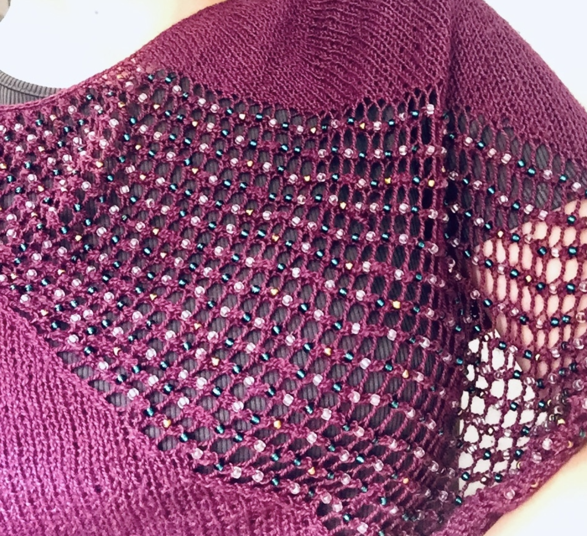
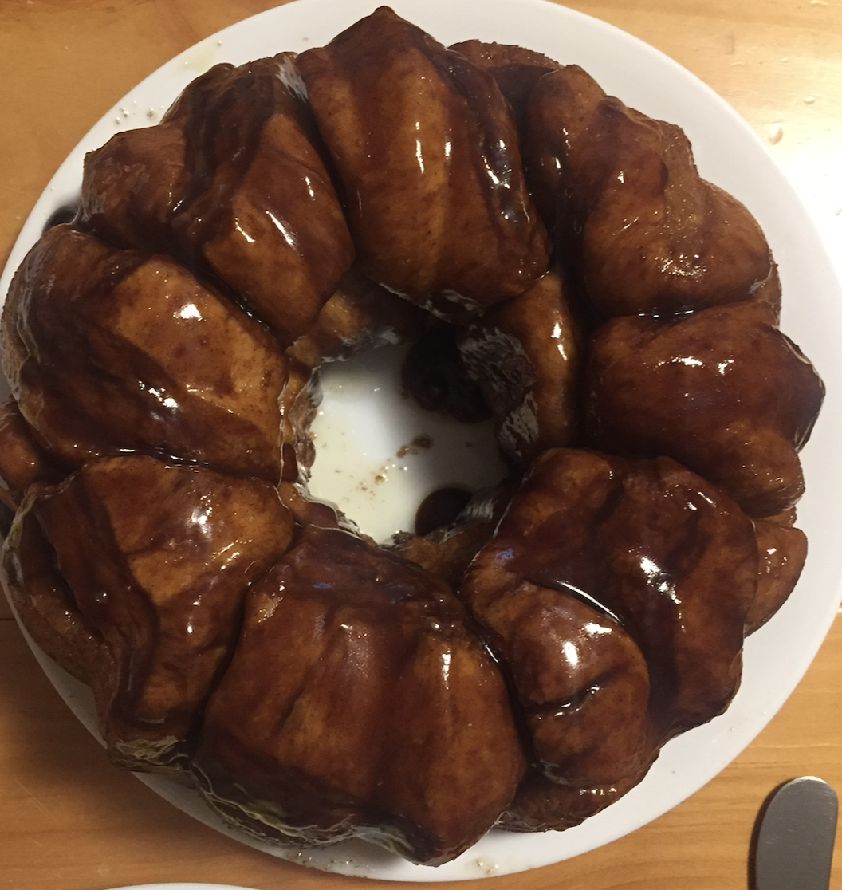

My first README.md (one for the scrapbook, I’m sure)
================

## Welcome!

You have the unfortunate luck of coming across this page. Learn about
me, at your own risk. Have fun!

## Wanna See Some Hobbies?

In no particular order of importance, here are some thing I do for fun!

##### Knitting

Have a look at some fun knitting projects I’ve done:

A cowl (scarf) with owls on the edge & a beaded cowl. There’s also some
yarn that I dyed with Kool-Aid!

##### Cooking & Baking

I also bake, cook, and hang around in the kitchen ominously. Seen here
is: bread, monkey bread ( \~1 inch bread dough balls with caramel sauce
drizzled in between), pizza, and zucchini & sweet corn pie

##### Obligatory Cat Photo

Here she is, in all her beauty and glory, Hazel the cat.

## Funky Fresh Plot Time

A Plot?? In My SDS class??? It’s more likely than you think.

<!-- -->

I made this plot earlier this year for my volunteer position, mapping
American support for the Keystone XL pipeline
