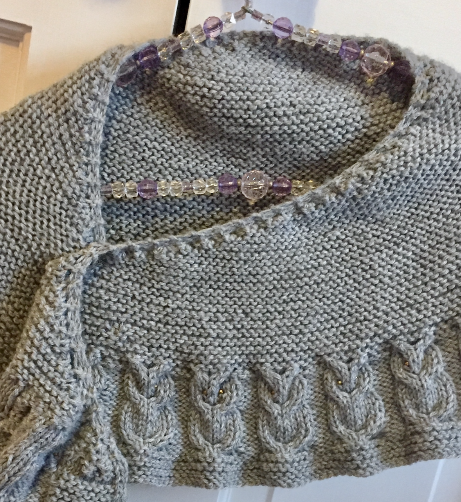
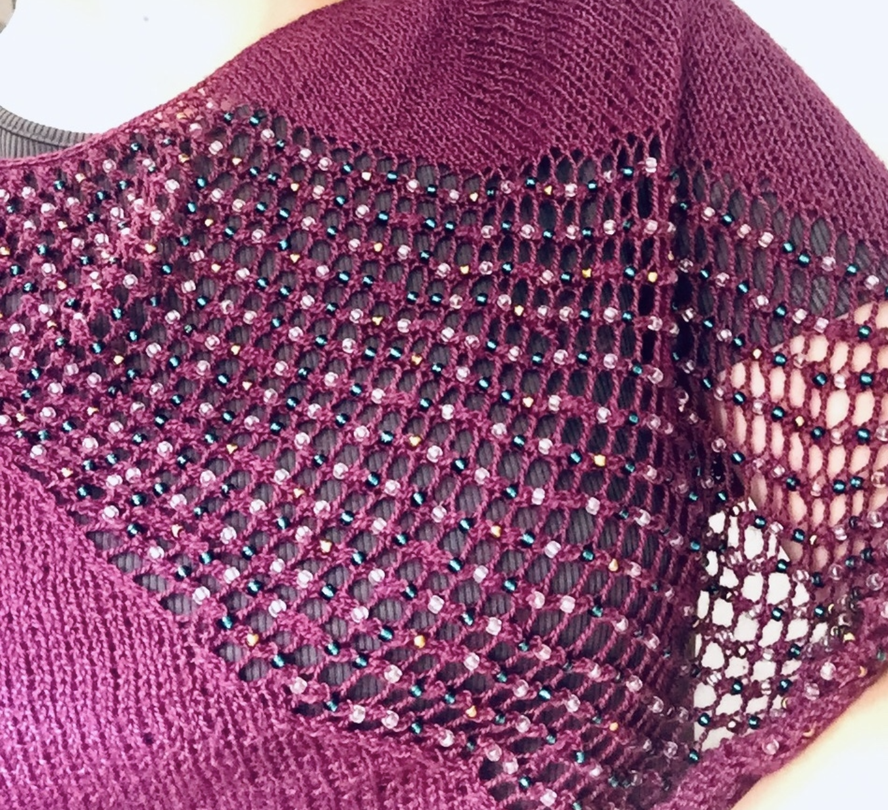
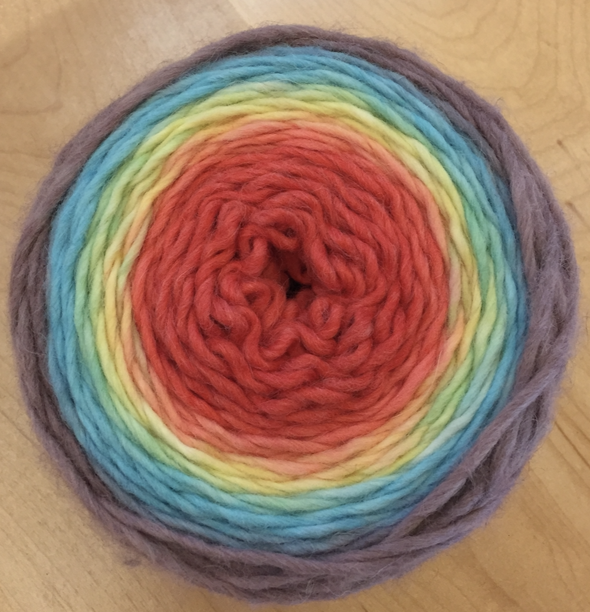
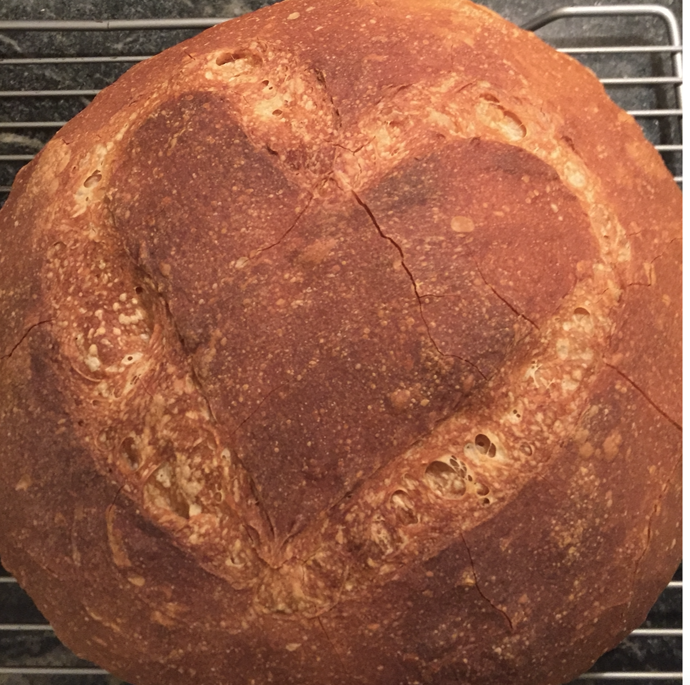
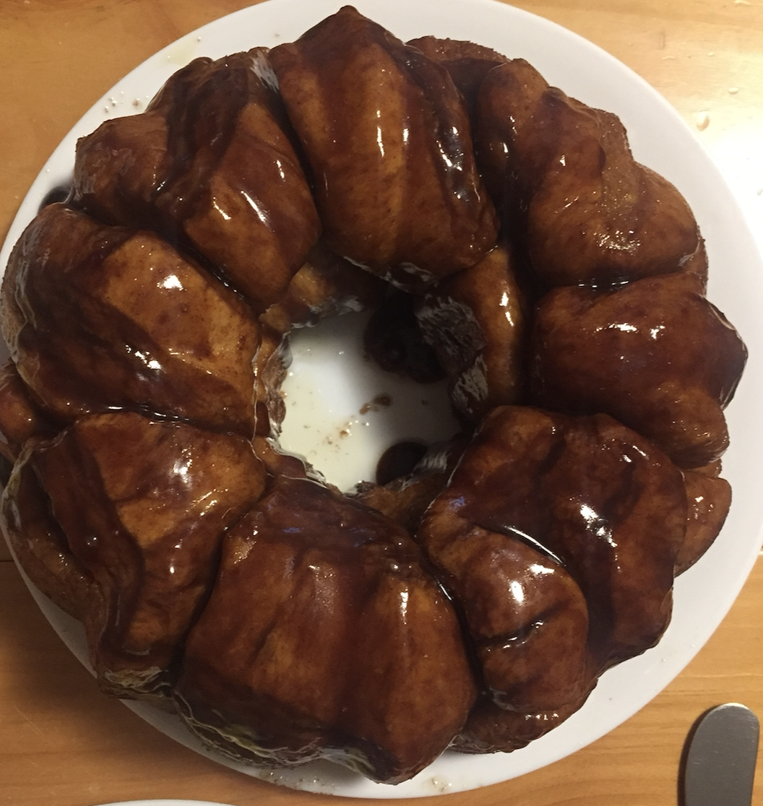
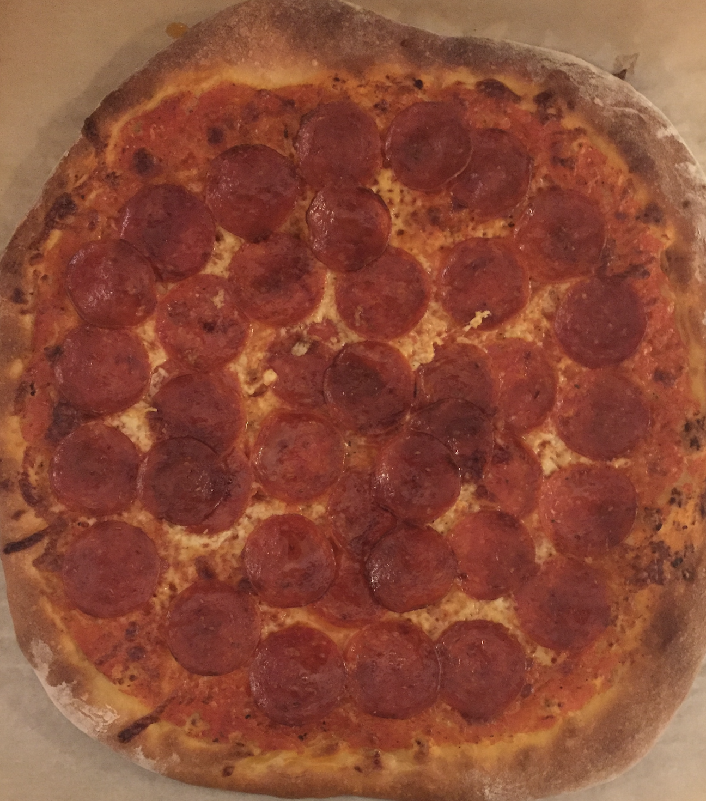
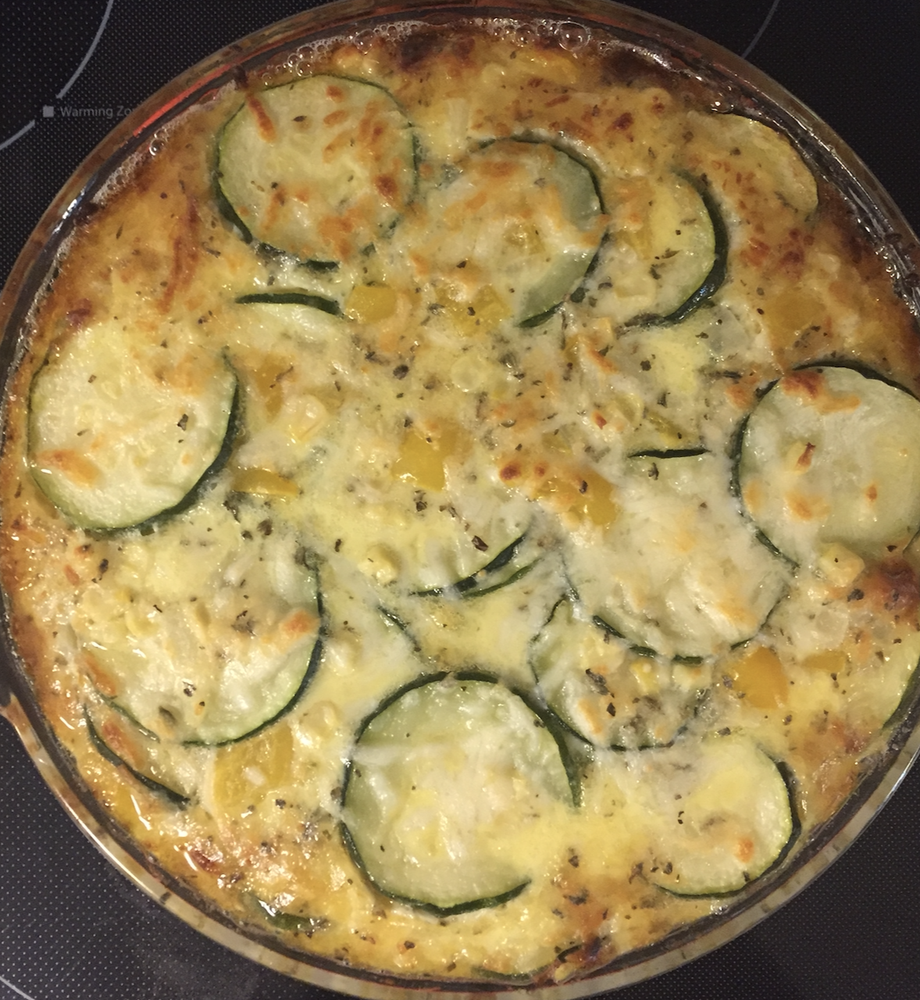
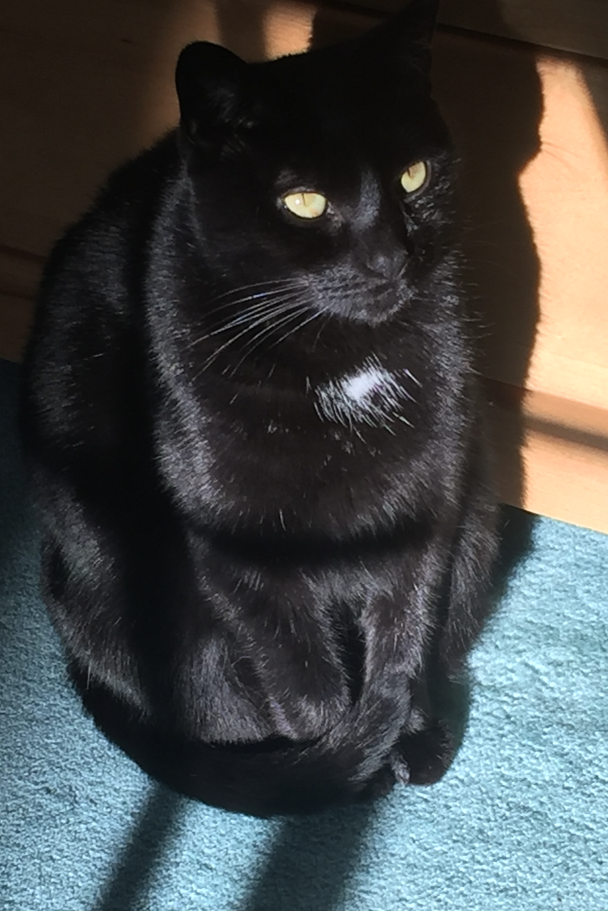

```{r setup, include=FALSE}
knitr::opts_chunk$set(echo = TRUE)
library(tidyverse)
library(dplyr)
library(leaflet)
library(lubridate)
```

## Welcome!

You have the unfortunate luck of coming across this page. Learn about me, at your own risk. Have fun!

## Wanna See Some Hobbies?

In no particular order of importance, here are some thing I do for fun!

##### Knitting
Have a look at some fun knitting projects I've done:

A cowl (scarf) with owls on the edge & a beaded cowl. There's also some yarn that I dyed with Kool-Aid!

{ width=250px }  { width=250px } { width=250px }


##### Cooking & Baking

I also bake, cook, and hang around in the kitchen ominously. Seen here is: bread, monkey bread ( ~1 inch bread dough balls with caramel sauce drizzled in between), pizza, and zucchini & sweet corn pie

{ width=200px }  { width=200px } { width=200px } { width=200px }

##### Obligatory Cat Photo

Here she is, in all her beauty and glory, Hazel the cat. 

{ width=500px }

## Funky Fresh Plot Time

A Plot?? In My SDS class??? It's more likely than you think. 

```{r pressure, echo=FALSE}
keystone_Favor <- tibble(
  date = c(ymd("2013-03-13", "2013-03-13", "2013-09-04", "2013-09-04", "2014-02-27", "2014-02-27", "2014-11-06", "2014-11-06", "2017-02-07", "2017-02-07")), 
  Position = c("Favor", "Oppose", "Favor", "Oppose", "Favor", "Oppose", "Favor", "Oppose", "Favor", "Oppose"),
  percent = c(66, 23, 65, 30, 61, 27, 59, 31, 42, 48)
  #Oppose = c(23, 30, 27, 31, 48)
 )


ggplot() +
  geom_point(data = keystone_Favor, mapping = aes(x= date, y = percent, color = Position)) + 
  geom_line( data = keystone_Favor, mapping = aes(x= date, y = percent, group = Position, color = Position)) +
  labs(title = "Percent of Americans in Favor of Keystone XL Pipeline", subtitle = "From the Pew Research Center") +
  ylab("Percent") +
  xlab("Date") + 
  theme_linedraw() + 
  ylim(0, 100)
```

I made this plot earlier this year for my volunteer position, mapping American support for the Keystone XL pipeline
